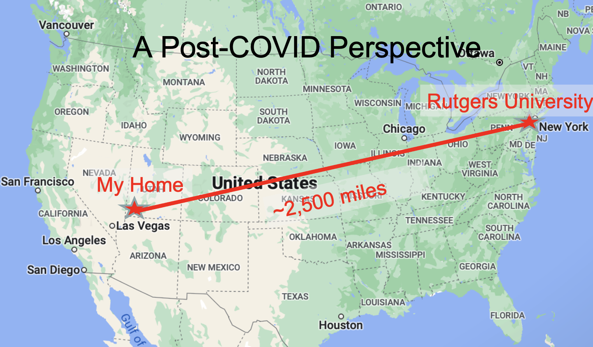
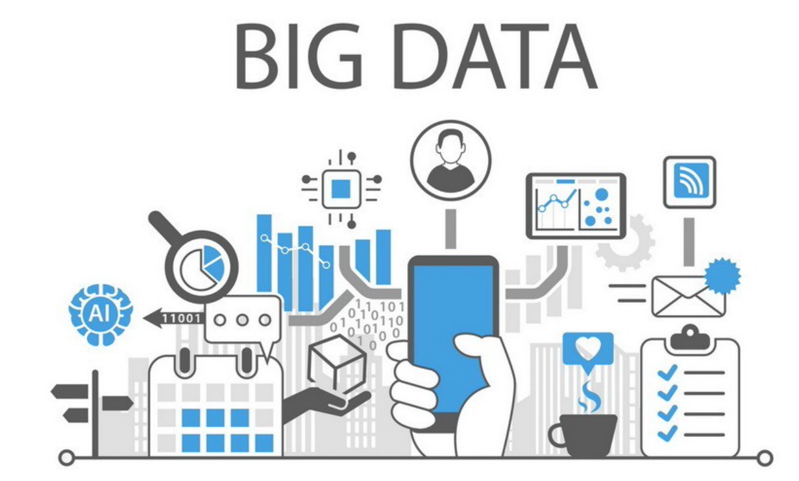
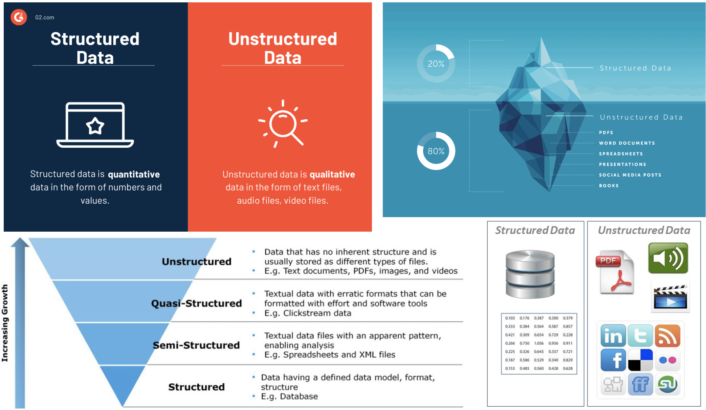
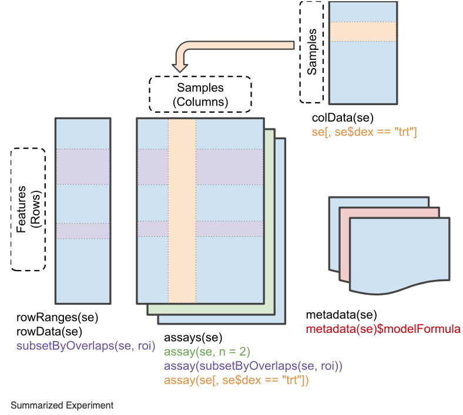
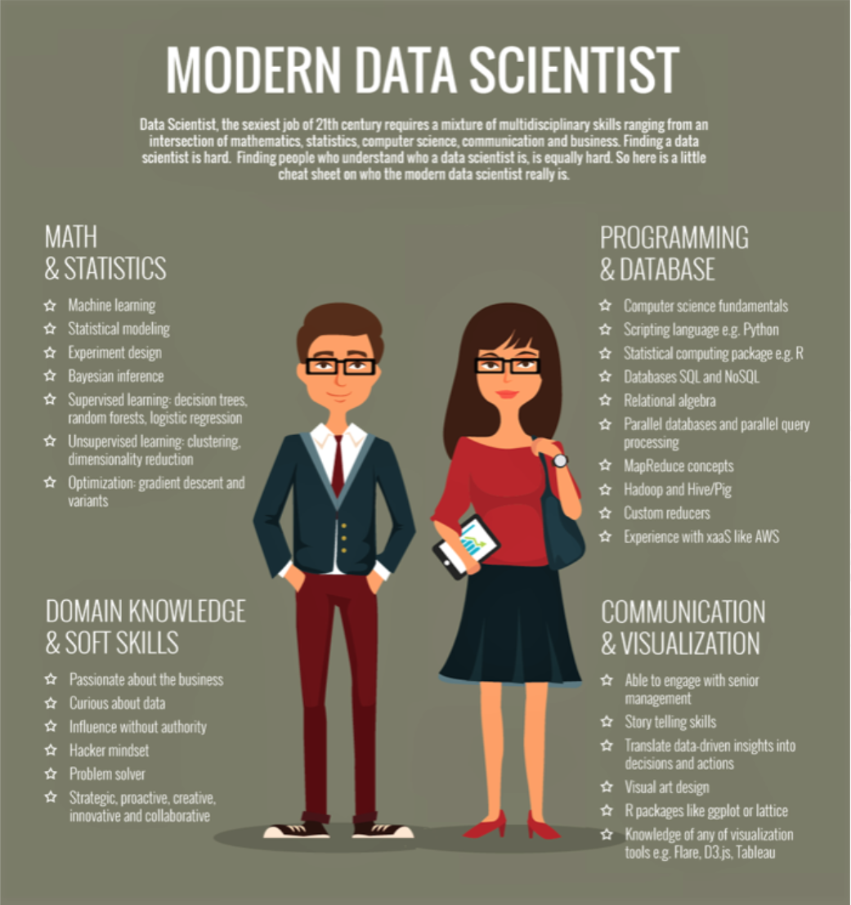
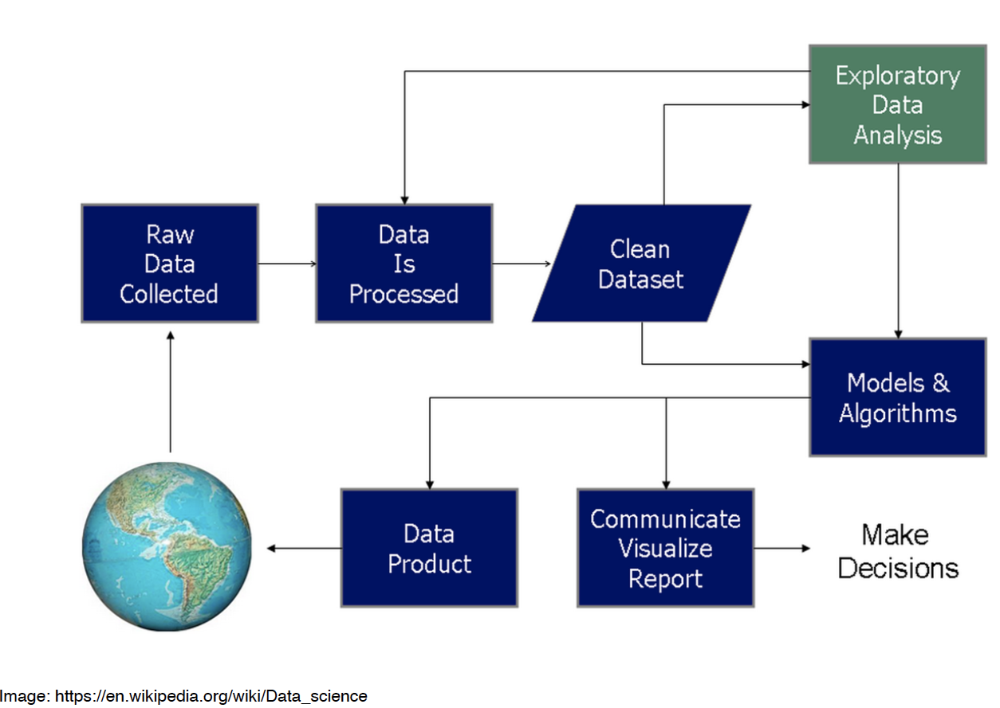
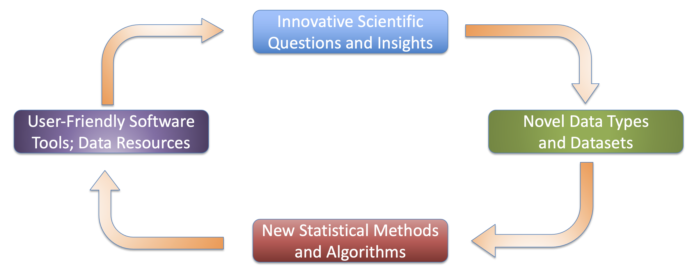

```{r setup, include=FALSE}
knitr::opts_chunk$set(echo = TRUE, fig.align="center")
img_path <- "figs/"
```


##


## 



## 


## Johnson Lab Research

[Here is a link to the Johnson Lab Research Page](https://www.wejlab.org)

## Center for Data Science Updates: Courses

1. GSND 5345Q: Fundamentals of Data Science (Jan 2026)
  - Command-line coding, literate programming, software development, version control, data wrangling and management, and visualization. 
2. GSND 5340Q: High Throughput Biomedical Data Analysis (April 2026)
  - Sequence alignment/QC, GWAS, gene expression and proteomics, epigenetics, metagenomics, and imaging data analysis.
3. GSND 5355Q:Machine Learning for Biomedical Data (October 2026)
  - Model training and validation, regression and regularization, unsupervised learning and clustering, dimension reduction and smoothing, supervised learning and classification, neural networks, and Bayesian learning  

## Things you should know about BMDA
\Large
* [Click here for the Zoom link](https://rutgers.zoom.us/j/92970463934?pwd=wVF7nGblCNaAMon3fFlRwboSgEiDUg.1)
* GitHub vs Canvas:
    + [https://github.com/wevanjohnson/2025_Spring_BMDA](https://github.com/wevanjohnson/2026_Spring_BMDA)
* [Link to Syllabus](https://github.com/wevanjohnson/2026_Spring_BMDA/blob/main/BiomedicalDataScience_Syllabus.docx)
* Background experience
  * Introductory statistics and molecular biology
* Prerequisites (Fundamentals of Data Science)
  * Basic Unix scripting
  * Amarel access and experience (ondemand, submissions)
  * Basic R programming: tidyverse, ggplot2, R Markdown
  * Working knowledge of git and GitHub


# Introduction to Data Science 

##
\center
{height="70%"}

Big Data has fundamentally changed how we look at science and business. Along with advances in analytic methods, they are providing unparalleled insights into our physical world and society

## Structured vs. Unstructured data
\center
{height="70%"}


## Structured vs. Unstructured data
\center
{height="70%"}

## Data Science Revolution
\begin{columns}
	\begin{column}{0.5\textwidth}
	\includegraphics[width=2.5in]{figs/ds_venn.png}
	\end{column}
	
	\begin{column}{0.5\textwidth}
{
	\begin{itemize}
	\item Few have all the skills	
	\item Flexibility in area (business, strategy, health care) and conditions
	\item Data science makes companies and data better! 
	\end{itemize}
}
	\end{column}
\end{columns}

##
\center


## Data Science Process
\center
{height="70%"}

## Scientific Cycle for Data Science
Johnson Lab Approach to Science:
\center
{height="90%"}


# Keeping the "Science" in Data Science

## Domain Knowledge

**Domain knowledge** is knowledge of a specific, specialized discipline or field, in contrast to general (or domain-independent) knowledge. For example, in describing a software engineer may have general knowledge of computer programming as well as domain knowledge about developing programs for a particular industry. People with domain knowledge are often regarded as specialists or experts in their field. (Wikipedia!)

## Analytics Hierarchy
\center
{height="70%"}


## Analytics Hierarchy
\center
{height="70%"}

## Session info
\tiny
```{r session info}
sessionInfo()
```

