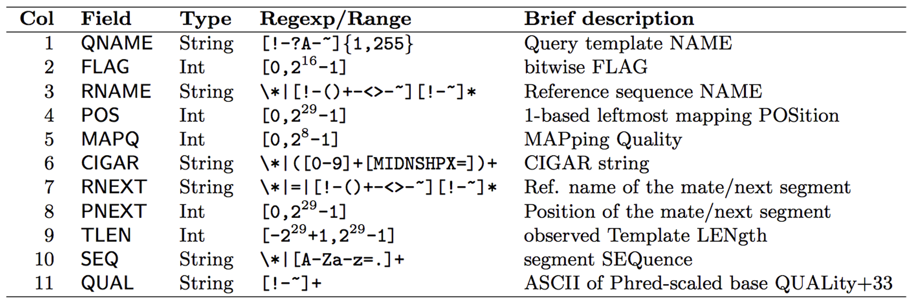
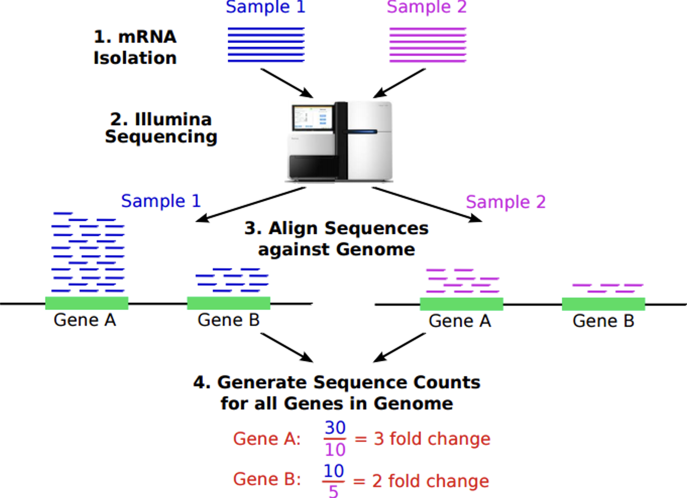

## Installing R Packages:
\Large
Install the following tools: `Rsubread`, `Rsamtools`,  and `SummarizedExperiment`. We will also need help from the `tidyverse.`

```{r eval=F}
if (!requireNamespace("BiocManager", quietly = TRUE))
  install.packages("BiocManager")
BiocManager::install(c("Rsubread","Rsamtools",
             "tidyverse","SummarizedExperiment"))
```


## Load Packages for Today
\large
We will be using the following packages for our RNA-seq alignment lecture:
```{r, warning=FALSE, message=FALSE}
library(tidyverse) ## tools for data wrangling
library(Rsubread) ## alignment and feature counts
library(Rsamtools) ## managing .sam and .bam files
library(SummarizedExperiment) ## managing counts data
```


## Using Rsubread to do Alignment

\Large
The following userguide will be helpful for you:

http://bioinf.wehi.edu.au/subread-package/SubreadUsersGuide.pdf


## Indexing your genome

\Large
Note that you will rarely do this for human alignment. You will usually download an existing index given to you by others who have already done this work. You will do this often if you are aligning microbial reads, e.g. MTB or some other organism for which others have not already made your index for you.

\normalsize
```{r, eval=F}
buildindex(basename="example_data/genome/ucsc.hg19.chr1_120-150M",
 reference="example_data/genome/ucsc.hg19.chr1_120-150M.fasta.gz")
```

\Large
Took me ~0.2 minutes!

## Aligning your reads:
\Large
Note that this outputs results in a .bam file and not a .sam file

\normalsize
```{r, eval=F}
align(index="example_data/genome/ucsc.hg19.chr1_120-150M",
      readfile1="example_data/R01_10_short500K.fq.gz",
      output_file="example_data/alignments/R01_10_short.bam",
      nthreads=4)
```

My old laptop was an Apple M2, with 8 cores (used 4 cores), 24GB RAM:

  - Took 15.7 minutes to align ~60M reads to the 30M bases
  - Took 0.7 minutes to align ~6.5M reads to the 30M bases
  - Took 0.3 minutes to align ~500K reads to the 30M bases

## Aligned Sequencing Data Formats (SAM and BAM)
Note that Rsubread outputs a .bam file (bam = binary alignment map) and not a .sam file (sam = sequence alignment map). Here is some information about a .sam file: https://en.wikipedia.org/wiki/SAM_(file_format)



## Aligned Sequencing Data Formats (SAM and BAM)
\Large
To convert .sam to .bam or vice versa, a package called Rsamtools. Using Rsamtools, you can convert bam to sam as follows:

```{r, eval=F}
asSam("example_data/alignments/R01_10_short.bam",
      overwrite=T)

# To convert to bam:
asBam("rna_seq/alignments/R01_10_short.bam")
```


## Feature counts
\Large
Now we can count reads hitting genes. Approaches/software:

* HT-Seq
* STAR
* Cufflinks
* RPKM FPKM or CPM
* RSEM
* edgeR
* findOverlaps (GenomicRanges)
* featureCounts (Rsubread)

## Feature counts
\center
{height=60%}

## Feature counts

```{r, eval=FALSE}
fCountsList = featureCounts(
  "example_data/alignments/R01_10_short.bam",
  annot.ext="example_data/genome/genes.chr1_120-150M.gtf",
  isGTFAnnotationFile=TRUE)

featureCounts = cbind(fCountsList$annotation[,1],
                      fCountsList$counts)

write.table(featureCounts,
    "example_data/alignments/R01_10_short.features.txt",
    sep="\t", col.names=FALSE, row.names=FALSE, quote=FALSE)
```


## From Toy Example to Real Data
\Large
Up to here we used a small toy example. For the rest of the lecture we will demonstrate a **complete pipeline** on the **asthma host microbiome RNA-seq dataset** on the Amarel cluster:

  - Download raw FASTQs from SRA
  - QC with FastQC + MultiQC
  - Align to the human genome with STAR (on SLURM)

\vspace{0.25cm}
You will repeat this same pipeline on the **HIV/TB dataset** for your homework.


## SRA -- Sequencing Read Archive
\Large

  - Raw sequencing data and alignment info
  - Metagenomics, environmental samples, biomedical sequencing

\vspace{0.25cm}
Download via:

  - **SRA-toolkit** -- the official NCBI tool (powerful but obtuse)
  - **EMBL-ENA** -- hosts FTP links directly (use `wget`/`curl`)
    - Most but not all SRA accessions available


## Download a single file (asthma dataset)
\Large
[Asthma host microbiome dataset (Pérez-Losada et al., 2015)](https://pubmed.ncbi.nlm.nih.gov/26277095/)

\footnotesize
```{bash, eval=F}
## attach the sratoolkit
module load sratoolkit

## Save accession to download
acc="SRR1528344"

## Download using fastq-dump
fastq-dump $acc
# option --split-3 is needed for paired end reads

## don't forget to compress the file!
gzip $acc.fastq
```


## Download all files (serially)
\Large
Loop over every accession in the asthma list:

\normalsize
```{bash, eval=F}
accs=( $( cat SRR_Acc_List_asthma.txt ) )
for i in $(seq 0 ${#accs[@]})
do
	fastq-dump ${accs[i]};
	gzip ${accs[i]}*
done
```


## Download all files (serially) via SLURM batch
\footnotesize
```{bash, eval=F}
#!/bin/bash
#SBATCH --job-name=asthma_download
#SBATCH --mem=1G
#SBATCH --time=01:00:00

module load sratoolkit
cd $HOME/tmp/

accs=( $( cat SRR_Acc_List_asthma.txt ) )
for i in $(seq 0 ${#accs[@]})
do
	fastq-dump ${accs[i]};
	gzip ${accs[i]}*
done
```
\Large
Save as a file and use `sbatch` to submit


## Download in parallel using a SLURM job array
\scriptsize
```{bash, eval=F}
#!/bin/bash
#SBATCH --job-name=asthma_download
#SBATCH --output=asthma.out
#SBATCH --array=0-27
#SBATCH --cpus-per-task=1
#SBATCH --mem=1G
#SBATCH --time=00:20:00

mkdir -p /scratch/$USER/asthma_data
cd /scratch/$USER/asthma_data

module load sratoolkit

accs=( $( cat SRR_Acc_List_asthma.txt ) )
acc_number=${accs[$SLURM_ARRAY_TASK_ID]}

fastq-dump --gzip $acc_number
```


## Generate FastQC reports
\Large
Run FastQC on every downloaded FASTQ:

\normalsize
```{bash, eval=F}
module load FastQC
fastqc *.fastq.gz --outdir=fastqc/
```

\Large
Or add the following inside your SLURM array script:

\normalsize
```{bash, eval=F}
module load FastQC
fastqc $acc_number.fastq.gz --outdir=fastqc/
```


## Generate a MultiQC report
\Large
Aggregate the per-sample FastQC outputs into a single report:

```{bash, eval=F}
module load miniconda
pip install multiqc
cd fastqc/
multiqc .
```


## STAR Alignment
\Large
**STAR** (Spliced Transcripts Alignment to a Reference) is the de facto aligner for bulk RNA-seq:

  - Splice-aware (handles exon-exon junctions)
  - Very fast, heavily multithreaded
  - Outputs sorted BAMs ready for featureCounts / HTSeq

\vspace{0.25cm}
On Amarel, STAR is available as a module: `module load STAR`.


## Download and index the human genome (one-time)
\tiny
```{bash, eval=F}
#!/bin/bash
#SBATCH --job-name=build_star_index
#SBATCH --output=star_index.out
#SBATCH --cpus-per-task=8
#SBATCH --mem=32G
#SBATCH --time=04:00:00

GENOME_DIR=/scratch/$USER/star_index
GENOME_FASTA=GRCh38.primary_assembly.genome.fa
GTF_FILE=gencode.v44.annotation.gtf

mkdir -p $GENOME_DIR
cd $GENOME_DIR

module load STAR
module load wget

wget https://ftp.ebi.ac.uk/pub/databases/gencode/Gencode_human/release_44/$GENOME_FASTA
wget https://ftp.ebi.ac.uk/pub/databases/gencode/Gencode_human/release_44/$GTF_FILE

STAR --runThreadN 8 \
     --runMode genomeGenerate \
     --genomeDir $GENOME_DIR \
     --genomeFastaFiles $GENOME_FASTA \
     --sjdbGTFfile $GTF_FILE \
     --sjdbOverhang 100   # For 100bp reads
```


## STAR alignment SLURM script -- asthma dataset
\scriptsize
```{bash, eval=F}
#!/bin/bash
#SBATCH --job-name=asthma_align
#SBATCH --output=asthma_%A_%a.out
#SBATCH --array=0-27
#SBATCH --cpus-per-task=4
#SBATCH --mem=12G
#SBATCH --time=01:00:00

# Paths
WORKDIR=/scratch/$USER/asthma_data
GENOME_INDEX=/scratch/$USER/star_index  # built in the previous slide

mkdir -p $WORKDIR
cd $WORKDIR

# Load required modules
module load sratoolkit
module load FastQC
module load STAR

# Pick this task's SRR from the asthma accession list
accs=( $(cat $SLURM_SUBMIT_DIR/SRR_Acc_List_asthma.txt) )
acc_number=${accs[$SLURM_ARRAY_TASK_ID]}
```


## STAR alignment SLURM script -- asthma (cont.)
\tiny
```{bash, eval=F}
# 1) Download FASTQ
echo "[$acc_number] Downloading FASTQ ..."
fastq-dump --gzip $acc_number

# 2) Run FastQC
mkdir -p fastqc
echo "[$acc_number] Running FastQC ..."
fastqc ${acc_number}.fastq.gz --outdir=fastqc/

# 3) STAR alignment
mkdir -p star_alignments/${acc_number}
echo "[$acc_number] Running STAR alignment ..."
STAR --runThreadN 4 \
     --genomeDir $GENOME_INDEX \
     --readFilesIn ${acc_number}.fastq.gz \
     --readFilesCommand zcat \
     --outFileNamePrefix star_alignments/${acc_number}/ \
     --outSAMtype BAM SortedByCoordinate

echo "[$acc_number] STAR alignment completed."
```

\normalsize
Save as `align_asthma.slurm` and submit with `sbatch align_asthma.slurm`.


## Your Turn -- HIV/TB Dataset (Homework)
\Large
For homework you will run **the same pipeline** -- SRA download, FastQC, MultiQC, STAR alignment -- on the **HIV/TB dataset**:

  - Accession list: `SRR_Acc_List_hivtb.txt` (33 samples)
  - Metadata: `hivtb_SRR_metadata.txt`
  - Adapt today's asthma SLURM scripts -- update the array range (`0-32`), the accession list, and the working directory.

\vspace{0.25cm}
The resulting BAMs / count matrices will feed directly into next lecture's differential expression analysis.


## Session info
\tiny
```{r session info}
sessionInfo()
```
